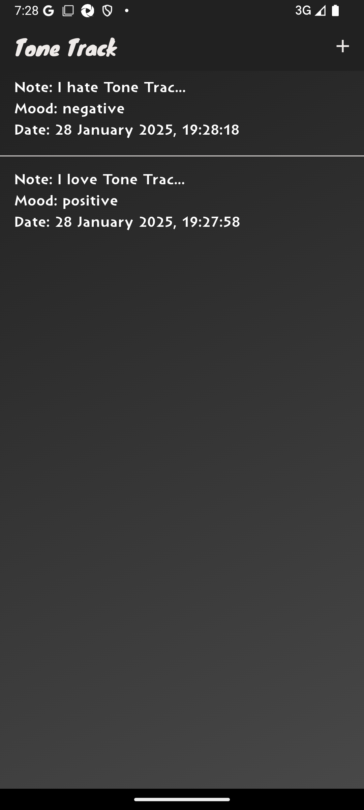
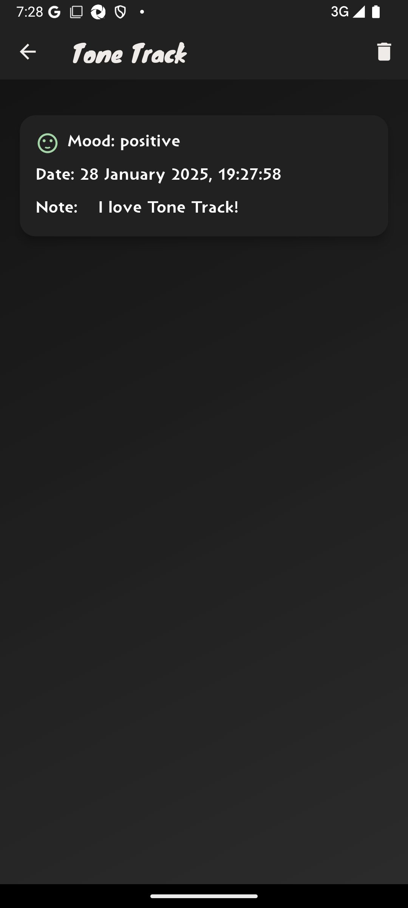
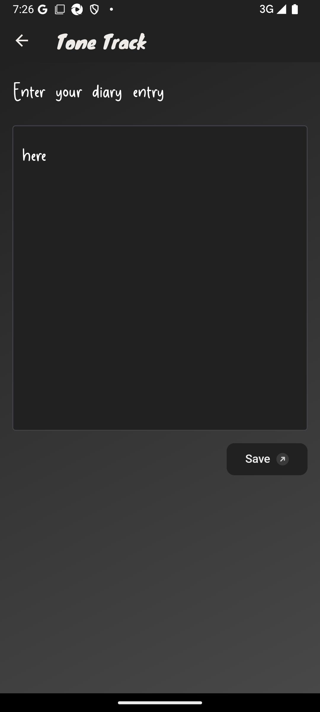

## Application Tone Track

[](LICENSE)

A diary application that analyzes entries based on sentiment analysis, helping users track and understand their emotional states over time.


**Public API:** ~~The application utilizes a publicly accessible sentiment analysis API, hosted on a private cloud~~. For more details, please visit the [GitHub](https://github.com/Alpaca00/tone-track-service).

The sentiment analysis API is no longer supported, and the sentiment status will always be neutral.

### Installation Guide on device

1. Download the latest APK from the [Releases](https://github.com/Alpaca00/tone-track-app/releases) page.
2. Enable installation from unknown sources in your device settings.
3. Install the APK file on your Android device.


### Prerequisites for Building the Application

Before you begin, ensure that you have the following dependencies installed on your local machine:

- **Flutter SDK**: [Download Flutter SDK](https://docs.flutter.dev/get-started/install)

For **Android applications**, you’ll also need:

- **Java 17**: [Download Java 17](https://openjdk.org/projects/jdk/17/)
- **Android SDK**: [Download Android SDK](https://developer.android.com/tools/releases/platform-tools)

### Installing Dependencies

To install all the necessary packages and build the app, run the following commands:

```shell
flutter packages get
flutter build apk
```

### A Snapshot of Screens

<p float="left">
  
  
  
  
</p>


### Useful Widgets

- **[LensButton](https://github.com/ksokolovskyi/lens_button)**: Amazing button with an animated effect, created by [ksokolovskyi](https://github.com/ksokolovskyi).
